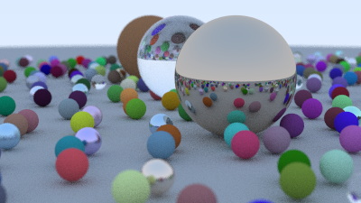
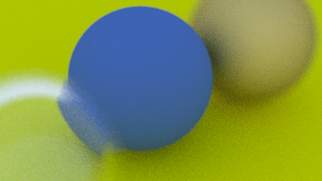
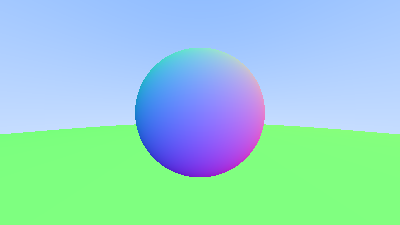

# Path Tracer in Rust

[](LICENSE)
[](https://www.rust-lang.org/tools/install)

This is a path tracer written in Rust that I built by following the [Ray Tracing in One Weekend](https://raytracing.github.io/books/RayTracingInOneWeekend.html) tutorial. 

It outputs a scene to a PPM image, which can be converted to a viewable PNG via your terminal or a website like [convertio](https://convertio.co/). 

## Features
- Positionable camera with field of view and defocus blur
- Spheres and background colour
- Three material types:
    - **Lambertian** (appears matte, using gamma-corrected lambertian reflection)
    - **Metal** (shiny or fuzzy reflections)
    - **Dielectric** (glass-like reflection and refraction) 
- Multi-object scenes
- Antialiasing

I worked in Rust so that I wrote my own code, as the tutorial uses C++.

I started a separate repository for the second book in the series, [Ray Tracing: The Next Week](https://raytracing.github.io/books/RayTracingTheNextWeek.html). I'd recommend using that code because it's optimised so runs a lot faster than the code in this book.

## Installation and Running the Path Tracer
The code is currently setup to render the final scene in the book at the resolution specified in the book, which gives an unrealistic rendering time (on my device at least). I'd highly recommend using [my book 2 code](https://github.com/CarolineMillan/rusty_raytracer_pt2) if you'd like to render an image.

Requires Rust 1.84+.

```bash
git clone https://github.com/CarolineMillan/rusty_raytracer.git 
cd rusty_raytracer
cargo build
cargo run
```

This will output `rendered_image.ppm` in the project root. To convert it to a viewable format, you can either use a tool in the terminal (if you have it installed), or use an online converter like [convertio](https://convertio.co/) to go from PPM to PNG.

## Example Images 
Here are some of the images I rendered using this code. The rest can be found in the rendered_images folder.




To see antialiasing, compare the edges of the following two spheres:



## Acknowledgements
- [Ray Tracing in One Weekend](https://raytracing.github.io/books/RayTracingInOneWeekend.html) tutorial
- Inspired by the original C++ code, fully reimplemented in Rust

## Licence
This software is available as open source under the terms of [the MIT Licence](https://opensource.org/license/MIT).